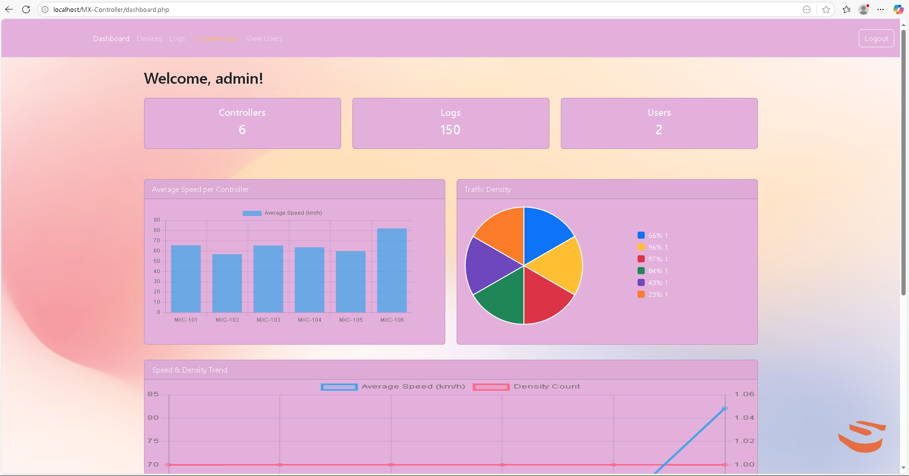
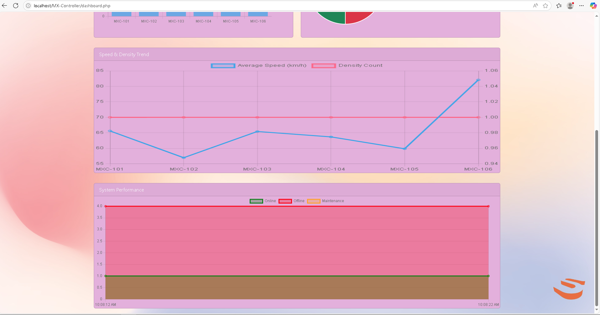
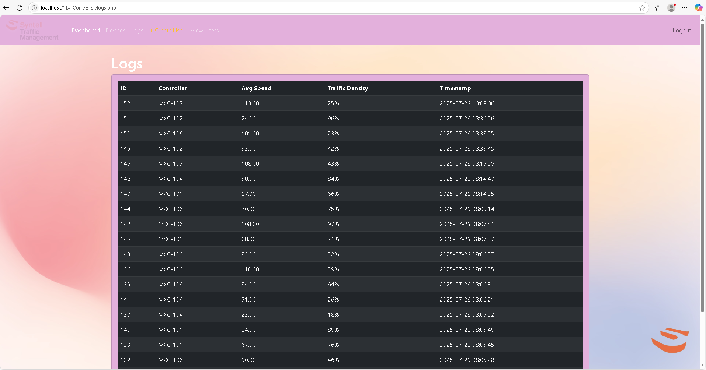
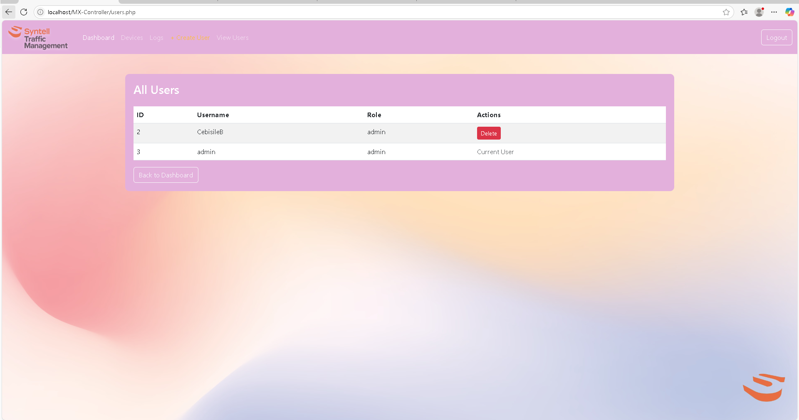

## *MX Controller - Traffic Management System*

A **web-based traffic management platform** designed to monitor and manage MX traffic controller devices in real time.  
This system provides **live status updates, alerts, location visualization, and performance analytics**.

---

## 🚦 Features
- **Device Management** – Add, edit, and delete MX controller devices.  
- **Controller Types** – Supports MX Maxi, MX STD, MX Lite, MX M20, and MX Pedestrian controllers.  
- **Real-Time Alerts** – Receive instant notifications with sound when devices go offline or online.  
- **Map Integration** – Visualize device locations using Leaflet (OpenStreetMap).  
- **Logs & Reports** – Track controller logs with timestamped speed and density data.  
- **Performance Analytics** – Interactive charts for traffic density, speed, and system performance.  
- **User Management** – Admin can create and manage user accounts.  

---

## 🛠️ Installation
1. Clone the Repository
```bash
git clone https://github.com/cebijuni/mx-controller.git
cd mx-controller
````

2. Setup Local Server

* Install **XAMPP** or any PHP + MySQL environment.
* Place the project folder in `htdocs` (for XAMPP).

3. Import the Database

* Open **phpMyAdmin** → Create a database `mx_controller`.
* Import the provided file: [`mx_controller.sql`](./database/mx_controller.sql).

4. Update Database Credentials

Edit `includes/db.php`:

```php
$host = 'localhost';
$user = 'root';
$pass = '';
$db   = 'mx_controller';
```

### 5. Run the Application

* Open your browser:
  **[http://localhost/mx-controller/](http://localhost/mx-controller/)**

---

## 🔒 Default Admin Login

* **Username:** `admin`
* **Password:** `admin123`

---

## 📸 Screenshots
## Screenshots
### Create User Page


### Dashboard1 Page


### Dahboard2 Page


### Devices Page


### Login Page


### Logs Page


### users Page


---

## 👨‍💻 Authors

* **Created by:** *Cebisile Bosman*
* **Email:** *[cebisilecjjunior.bosman@gmail.com]*
* **GitHub:** (https://github.com/cebijuni)

---


